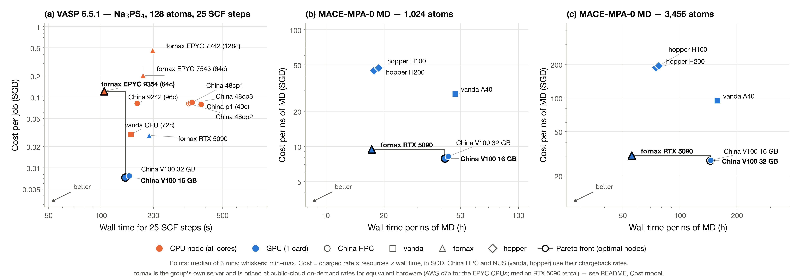

# HPC node benchmark: time vs. cost Pareto front

Which compute node should we use for a given job? This repository benchmarks every CPU and GPU partition
available to the Deng Group on four clusters — **China HPC (超算云平台, Inner Mongolia 2)**, **NUS vanda**,
**NUS hopper** and the group's own **fornax** — with identical VASP and MACE-MD workloads, and plots
**wall time against cost** so that the Pareto-optimal nodes (nothing is both faster and cheaper) stand out.

Status: **complete** (2026-10-02). 15 partitions × 3 repeats per workload; all runs validated.



**Headline results**

| Workload | Fastest | Cheapest | Note |
|---|---|---|---|
| VASP SCF (128 atoms) | fornax EPYC 9354 node — **104 s** (0.12 SGD\*) | China V100 (1 GPU) — **0.007 SGD/job** | V100 is 30 % slower than the fastest CPU node but 17× cheaper; vanda CPU is the best NUS-rate option (148 s, 0.03 SGD) |
| MACE MD, 1,024 atoms | fornax RTX 5090 — **17 h/ns** (9.4 SGD/ns\*) | China V100 — **7.9 SGD/ns** | H100/H200 match the RTX 5090 on speed at ~5× the cost per ns |
| MACE MD, 3,456 atoms | fornax RTX 5090 — **56 h/ns** (30 SGD/ns\*) | China V100 32 GB — **27 SGD/ns** | same ranking; H100/H200 at 75 h/ns, 190 SGD/ns |

\* fornax is the group's own server and has no chargeback; every fornax price on this page is a public-cloud proxy, not what the group pays — see the [footnote](#footnote).

---

## 1. What was benchmarked

### Nodes

| Site | Partition | Hardware charged per job | VASP | MACE |
|---|---|---|---|---|
| China HPC | `p1` | 2× Xeon Gold 6138, 40 cores | ✓ | |
| China HPC | `9242` | 2× Xeon Platinum 9242, 96 cores | ✓ | |
| China HPC | `48cp1` / `48cp2` / `48cp3` | Xeon Platinum 8163 / 8255C / 8168, 48 cores | ✓ | |
| China HPC | `v100`, `v100g32` | 1× Tesla V100 SXM2, 16 GB / 32 GB | ✓ (nvhpc build) | ✓ |
| vanda | `batch_cpu` | 2× Xeon Platinum 8452Y, 72 cores | ✓ | |
| vanda | `batch_gpu` | 1× A40 48 GB | — (no GPU build) | ✓ |
| fornax | `genoa` → EPYC 9354 nodes (c16–c20) | 2× AMD EPYC 9354, 64 cores | ✓ | |
| fornax | `genoa` → EPYC 7543 node (c13) | 2× AMD EPYC 7543, 64 cores | ✓ | |
| fornax | `largemem` | 2× AMD EPYC 7742, 128 cores | ✓ | |
| fornax | `rtx5090` | 1× GeForce RTX 5090 32 GB | ✓ (nvhpc build) | ✓ |
| hopper | `h100`, `h200` | 1× H100 80 GB / 1× H200 141 GB | — (no VASP on hopper) | ✓ |

CPU jobs use a whole node exclusively and are charged for all its cores; GPU jobs use one GPU and are charged per GPU.
Hardware models are taken from `lscpu` / `nvidia-smi` logged by each job. Full inventory: [`config/nodes.yaml`](config/nodes.yaml).

### Workloads

Both workloads use cubic Na₃PS₄ (a = 6.9965 Å), the system used in the group's MACE work.

| | **W1 — VASP single point** | **W2 — MACE molecular dynamics** |
|---|---|---|
| Code | VASP 6.5.1, the build installed at each site (vanda: Intel 2023b + OpenMPI; fornax: `vasp/vasp.6.5.1` CPU, `_nvhpc` GPU; China: `vasp-intel2024.2/6.5.1` CPU, `vasp/6.5.1-nvhpc` GPU) | mace-torch 0.3.15, torch 2.8.0 + cu128, Python 3.11 — one identical environment on every site ([`envs/`](envs/)) |
| System | 2×2×2 supercell, 128 atoms | 4×4×4 = 1,024 atoms and 6×6×6 = 3,456 atoms |
| Settings | PBE, PAW `Na_pv P S`, ENCUT 520 eV, Γ-centred 2×2×2 k-mesh, `NELM = NELMIN = 25` (exactly 25 SCF steps), `LWAVE = LCHARG = .FALSE.` | MACE-MPA-0 medium, float32, NVT Langevin 600 K, 1 fs, fixed seed |
| Parallelism | CPU: all cores, 1 rank/core, `NCORE = 4`; GPU: 1 GPU, 1 MPI rank | 1 GPU, 8 host threads (3 on China V100 nodes) |
| Timed quantity | `LOOP+` real time from OUTCAR (excludes start-up and I/O) | steps/s over 2,000 (1,024 atoms) or 1,000 (3,456 atoms) timed steps after warm-up → **hours per ns** |

Inputs (POSCAR, INCAR, KPOINTS, MACE structures) are in [`inputs/`](inputs/) with MD5 sums; the licensed POTCAR is not committed (MD5 in `inputs/vasp/POTCAR.md5`).

---

## 2. Method

- **3 repeats** of every workload on every partition, on different nodes where the scheduler allowed. Plotted values are **medians**; whiskers and the tables give min–max.
- **Exclusive nodes** (`--exclusive` / `place=excl`) so other jobs cannot affect timings. Queue waiting time is not included.
- **Identical inputs and software.** The same POSCAR/INCAR/KPOINTS/POTCAR (MD5-checked) and the same MACE model file (MD5 `d217978d…`) were used everywhere. The MACE environment was built once on vanda and distributed as a conda-pack tarball (MD5 `eb73c579…`) because China HPC has no outbound internet.
- **Correctness check before timing.** VASP: every one of the 36 runs converged to the same total energy, −526.017345 eV, on every CPU and GPU build. MACE: a fixed rattled 128-atom structure gives E = −523.38602935 eV on A40, V100 16/32 GB, RTX 5090, H100 and H200 (agreement to 10⁻¹³ eV; [`results/fingerprint/`](results/fingerprint/)).
- **Pareto front:** a partition is Pareto-optimal if no other partition is both faster and cheaper.

---

## 3. Cost model

`cost = rate × resources charged × wall time`, converted to SGD. Rates and sources: [`config/pricing.yaml`](config/pricing.yaml).

| Site | Resource | Rate | ≈ SGD | Source |
|---|---|---|---|---|
| China HPC | CPU | 0.1 CNY / core-h | 0.019 / core-h | Provider price list (超算云平台), as billed to the group account |
| China HPC | V100 | 1 CNY / GPU-h | 0.19 / GPU-h | same |
| vanda | CPU | 0.01 SGD / core-h | 0.010 / core-h | NUS IT chargeback, *REC Roadshow 2026 – HPC briefing*, slide 22 (Jul 2026); [nusit.nus.edu.sg/hpc/hpc-gpu-systems](https://nusit.nus.edu.sg/hpc/hpc-gpu-systems/) |
| vanda | A40 | 0.6 SGD / GPU-h | 0.60 / GPU-h | same |
| hopper | H100 / H200 | 2.5 SGD / GPU-h | 2.50 / GPU-h | same |
| **fornax** (own server) | EPYC 9354 / 7543 / 7742 CPU | 0.0513 USD / core-h\* | 0.065 / core-h\* | **Proxy:** AWS EC2 `c7a` (4th-gen AMD EPYC) on-demand, us-east-1, Jul 2026 — [economize.cloud c7a pricing](https://www.economize.cloud/resources/aws/pricing/ec2/c7a.16xlarge/) |
| **fornax** (own server) | RTX 5090 | 0.43 USD / GPU-h\* | 0.545 / GPU-h\* | **Proxy:** median of ~100 RTX 5090 32 GB cloud listings, Jul 2026 — [computeprices.com](https://computeprices.com/providers/gpu/gpus/rtx5090), [gpuperhour.com](https://gpuperhour.com/rent/rtx-5090) |

FX (13 Sep 2026): 1 SGD = 5.2856 CNY, 1 USD = 1.2671 SGD.

\* See the [footnote](#footnote) on the fornax price.

---

## 4. Results

Medians of 3 runs; ★ = Pareto-optimal; \* = fornax cloud-proxy price (see [footnote](#footnote)). Tables generated by `python analysis/summary.py`.

**VASP — 128-atom Na₃PS₄, 25 SCF steps**

| Node | Hardware (charged) | Time (s) median [min–max] | Cost per job (SGD) | |
|---|---|---|---|---|
| fornax EPYC 9354 (64c) | 2× EPYC 9354 (64 c) | 104 [101–104] | 0.121\* | ★ |
| China V100 16 GB | 1× V100 SXM2 16 GB | 138 [131–139] | 0.00724 | ★ |
| China V100 32 GB | 1× V100 SXM2 32 GB | 145 [145–146] | 0.00762 |  |
| vanda CPU (72c) | 2× Xeon Platinum 8452Y (72 c) | 148 [147–149] | 0.0297 |  |
| China 9242 (96c) | 2× Xeon Platinum 9242 (96 c) | 161 [159–161] | 0.0813 |  |
| fornax EPYC 7543 (64c) | 2× EPYC 7543 (64 c) | 174 [174–231] | 0.201\* |  |
| fornax RTX 5090 | 1× RTX 5090 32 GB | 189 [188–189] | 0.0286\* |  |
| fornax EPYC 7742 (128c) | 2× EPYC 7742 (128 c) | 198 [198–198] | 0.458\* |  |
| China 48cp2 | Xeon Platinum 8255C (48 c) | 319 [314–331] | 0.0805 |  |
| China 48cp3 | Xeon Platinum 8168 (48 c) | 326 [323–330] | 0.0821 |  |
| China 48cp1 | Xeon Platinum 8163 (48 c) | 334 [333–335] | 0.0841 |  |
| China p1 (40c) | 2× Xeon Gold 6138 (40 c) | 377 [376–380] | 0.0791 |  |

**MACE MD — 1,024 atoms**

| Node | Hardware (charged) | Time (h / ns) median [min–max] | Cost per ns (SGD) | |
|---|---|---|---|---|
| fornax RTX 5090 | 1× RTX 5090 32 GB | 17.3 [17.1–17.3] | 9.42\* | ★ |
| hopper H200 | 1× H200 141 GB | 17.8 [17.8–18.1] | 44.4 |  |
| hopper H100 | 1× H100 80 GB | 18.8 [18.7–18.9] | 47.1 |  |
| China V100 16 GB | 1× V100 SXM2 16 GB | 41.6 [40.9–47.1] | 7.86 | ★ |
| China V100 32 GB | 1× V100 SXM2 32 GB | 43.3 [43.2–43.4] | 8.18 |  |
| vanda A40 | 1× A40 48 GB | 47 [47–49.7] | 28.2 |  |

**MACE MD — 3,456 atoms**

| Node | Hardware (charged) | Time (h / ns) median [min–max] | Cost per ns (SGD) | |
|---|---|---|---|---|
| fornax RTX 5090 | 1× RTX 5090 32 GB | 55.7 [55.6–55.8] | 30.3\* | ★ |
| hopper H200 | 1× H200 141 GB | 74.6 [74.5–75.5] | 186 |  |
| hopper H100 | 1× H100 80 GB | 77.4 [77.3–77.5] | 193 |  |
| China V100 32 GB | 1× V100 SXM2 32 GB | 145 [144–145] | 27.3 | ★ |
| China V100 16 GB | 1× V100 SXM2 16 GB | 145 [144–161] | 27.5 |  |
| vanda A40 | 1× A40 48 GB | 157 [157–158] | 94.4 |  |

### Interpretation

- **VASP.** The fastest node is fornax's EPYC 9354 (3.7–4.2 s per SCF step), followed by a single China V100
  (138 s) and vanda's 72-core node (148 s). On cost the China V100 wins by a wide margin (0.007 SGD per job);
  among CPU nodes charged at university rates, vanda is ~3× cheaper per job than any China CPU partition and faster
  than all of them. The consumer RTX 5090 is usable for VASP (189 s, FP64-limited) and, at the proxy price\*, as cheap as vanda CPU.
  fornax's 128-core EPYC 7742 node is slower than its 64-core EPYC 9354 nodes for this 128-atom cell.
- **MACE MD.** The RTX 5090 is the fastest GPU at both system sizes; the H100 and H200 are within a few per cent at 1,024 atoms
  and ~35 % slower at 3,456 atoms, at ~5× the cost per ns. The V100s are 2.5× slower than the RTX 5090 but the cheapest per
  ns. The A40 is slowest and, at NUS rates, three times the cost of the V100s. CPU nodes were not benchmarked for MACE.
- **Caveats.** MACE ran in float32 without cuEquivariance, which favours consumer GPUs and under-represents H100/H200
  for larger systems. fornax costs are a cloud proxy\*. One fornax genoa node (`c15`) was 6–8× slower than its
  identical siblings in three separate runs and was excluded; one RTX 5090 node (`g01`) was 7–14× slower than its
  identical siblings for both VASP and MACE, and its VASP run was replaced by one on another node — both are documented, with evidence and a message for the fornax admin, in [`docs/NODE_ISSUES.md`](docs/NODE_ISSUES.md).

---

## 5. Reproducing

```
config/pricing.yaml          rates + sources            config/nodes.yaml   partition inventory
inputs/vasp/, inputs/mace/   benchmark inputs (+ MD5)   envs/               pinned MACE environment
jobs/common.sh               shared run logic           jobs/<site>/        PBS / Slurm job scripts + submit_production.sh
analysis/collect.sh          pull results from all sites
analysis/pareto.py           figure (PNG + PDF)         analysis/summary.py tables for this README
results/<site>/<partition>/<workload>/repN.json   one record per run (timing, energy, host, versions)
```

```bash
# on each site, from the repo root
jobs/<site>/submit_production.sh          # (fornax CPU: jobs/fornax/submit_production_cpu.sh)
# locally
analysis/collect.sh
python analysis/pareto.py && python analysis/summary.py
```

Python requirements for the analysis: `pyyaml matplotlib adjustText`.

Operational notes for the job scripts: fornax GPU nodes do not mount `/scratch` (run from `/home`); pin fornax nodes
with `vnode=fornax-cNN` (`host=` does not match CPU nodes); vanda/hopper jobs use project `CFP05-CF-241`.

---

<a name="footnote"></a>
**\* fornax prices.** fornax belongs to the group and nobody is charged for using it. To place it on the same cost
axis as the chargeback clusters, every fornax price on this page is a *replacement-cost proxy*: what equivalent hardware
costs to rent on-demand from a public cloud in July 2026 — **CPU:** AWS EC2 `c7a` (4th-gen AMD EPYC), us-east-1
on-demand, USD 0.0513 per vCPU-hour, 1 vCPU = 1 core ([economize.cloud](https://www.economize.cloud/resources/aws/pricing/ec2/c7a.16xlarge/));
**RTX 5090:** median of ~100 RTX 5090 32 GB cloud listings, USD 0.43 per GPU-hour
([computeprices.com](https://computeprices.com/providers/gpu/gpus/rtx5090), [gpuperhour.com](https://gpuperhour.com/rent/rtx-5090)).
Converted at 1 USD = 1.2671 SGD (13 Sep 2026). This overstates fornax relative to the subsidised NUS rates (AWS CPU time
is ~6× vanda's rate), so fornax CPU points sit high on the plot for pricing reasons, not hardware reasons. The proxy can
be replaced in [`config/pricing.yaml`](config/pricing.yaml) (e.g. by an amortised purchase price or the NUS rate) and the
figure and tables regenerate with `python analysis/pareto.py && python analysis/summary.py`.
